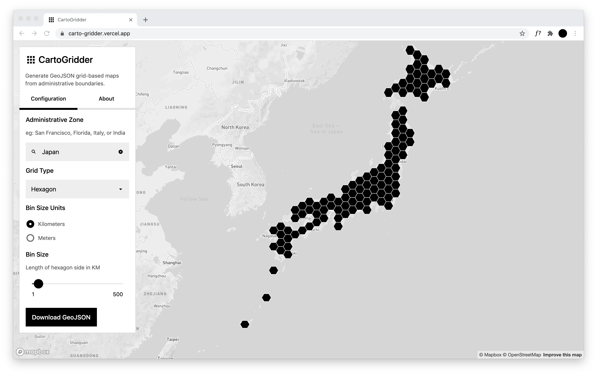

# CartoGrid

Use this tool to generate and download grid-based maps from administrative-level boundary geometries.

City, county, state, and country level zones (excluding China) are supported.

The grid-based bins are generated using [TurfJS](https://turfjs.org/).

This tool was created for Day 10 of the [#30DayMapChallenge](https://twitter.com/tjukanov/status/1311568912950140930): Grid.

Made by [@dbabbs](https://twitter.com/dbabbs), with help from [@burritojustice](https://twitter.com/burritojustice).
